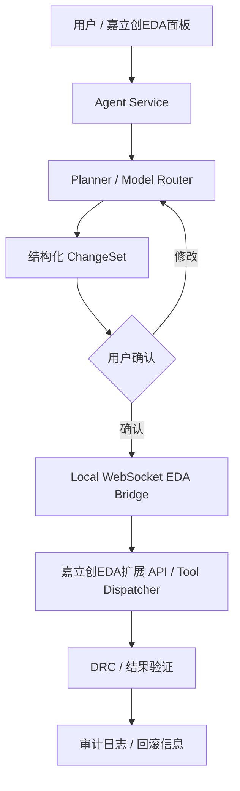

# JLCircuit Agent 架构说明

## 核心原则

LLM 负责理解、规划和解释；确定性工具负责读取、修改和验证设计。

模型不直接接触嘉立创EDA原始 API，也不直接执行任意 JavaScript。模型输出结构化 `ChangeSet`，由本地扩展的 capability allowlist 校验后执行。

## 运行时分层



## 初始 MVP

1. 连接当前 EDA 窗口。
2. 读取当前项目、文档和选区。
3. 读取原理图/PCB摘要、网络和 DRC 结果。
4. 生成结构化变更计划。
5. 用户确认后执行有限的原理图和 PCB 变更。
6. 执行 DRC 并保存审计信息。

## 当前 Bridge 协议

Agent Service 监听 `ws://127.0.0.1:49630/bridge`，EDA 扩展主动连接，消息使用 JSON 封装：

```json
{
  "type": "request",
  "request": {
    "requestId": "...",
    "sessionId": "...",
    "operation": "tool_call",
    "tool": "easyeda_get_context",
    "payload": {}
  }
}
```

HTTP 层提供 MCP 风格的工具目录和调用入口；真正的 EDA API 只在扩展进程内执行。

扩展侧 WebSocket 使用官方 `eda.sys_WebSocket.register/send/close`，而不是主扩展进程中的浏览器原生 WebSocket；嘉立创EDA扩展设置中必须允许 External Interaction。

当前工具目录位于 `packages/mcp`，扩展工具执行位于 `extensions/jlcircuit-eda/src/eda-adapter.ts`。

## 视觉验证闭环

写入操作不能只根据 API 返回成功判断结果。扩展端通过 `DMT_EditorControl.zoomTo`、`zoomToRegion` 和 `getCurrentRenderedAreaImage` 生成真实画布截图，Bridge 将其作为图片内容块返回：

```text
write tool
  -> read context / run DRC/ERC
  -> locate changed region
  -> capture rendered canvas PNG
  -> return semantic evidence + image evidence
```

当前提供 `easyeda_canvas_locate`、`easyeda_canvas_capture`、`easyeda_canvas_capture_region` 和 `easyeda_post_write_verify`。截图证明的是视觉结果，不替代 netlist、DRC/ERC 等电气验证；当前版本也明确把重叠、交叉和标签碰撞的判断标记为需要模型或人工复核。

## 原理图移动的安全边界

官方原理图 API 暴露的是图元级 `modify`，不保证等价于编辑器鼠标拖拽的橡皮筋行为。因此 `easyeda_schematic_move_component` 当前是 Beta/高风险工具：

- 修改元件坐标前读取引脚和导线快照；
- 对能匹配到旧引脚坐标的导线首尾端点进行补偿；
- 返回移动导线、未解析导线和连接校验状态；
- 默认不保存项目，必须显式传入 `save: true`；
- 复杂分支、总线、网络标签和 UI 设置差异必须经过 DRC/ERC 与人工确认。

自动布线、批量规则修改和无确认删除操作不属于初始默认能力。

## 重要约束

- EDA API 运行在本地编辑器扩展环境中，后端不能假设拥有直接 EDA 数据访问权。
- `ChangeSet` 使用稳定的设计对象 ID 和预期旧值，执行前必须重新读取并校验。
- 每个写操作都需要声明 `riskLevel` 和 `requiresConfirmation`。
- 由于部分嘉立创EDA接口处于 BETA 状态，Bridge 必须保留 capability probe 和版本兼容层。
