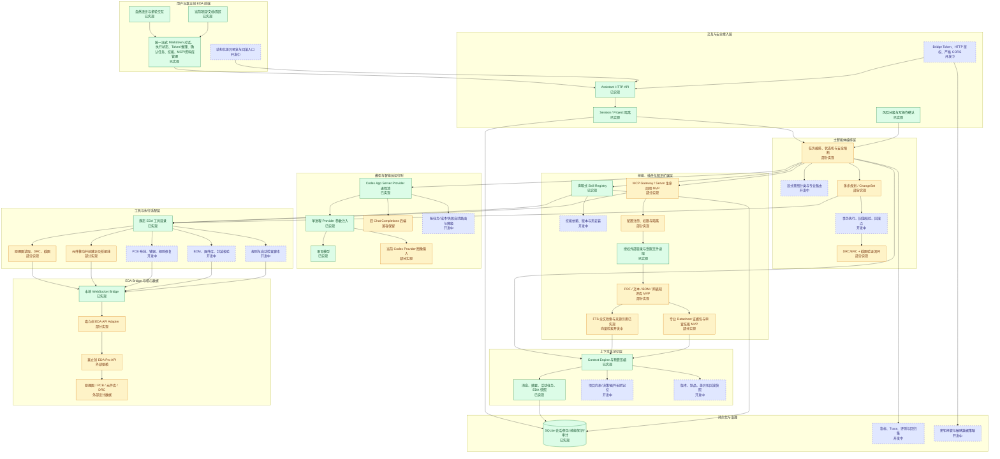
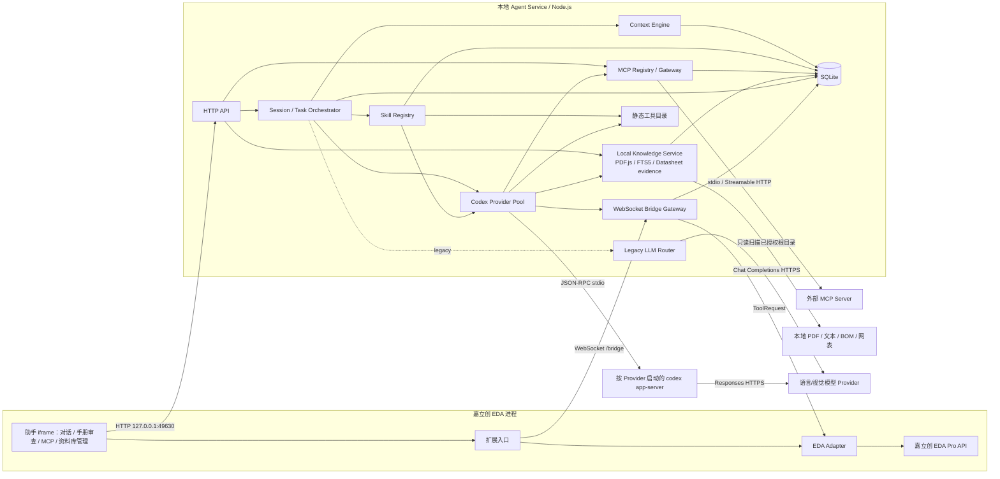
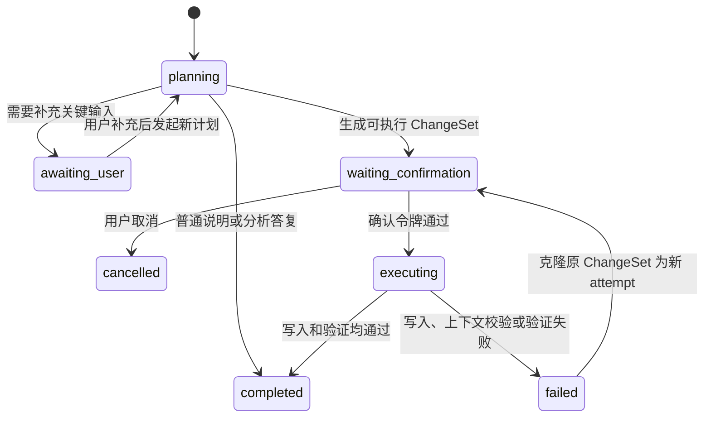
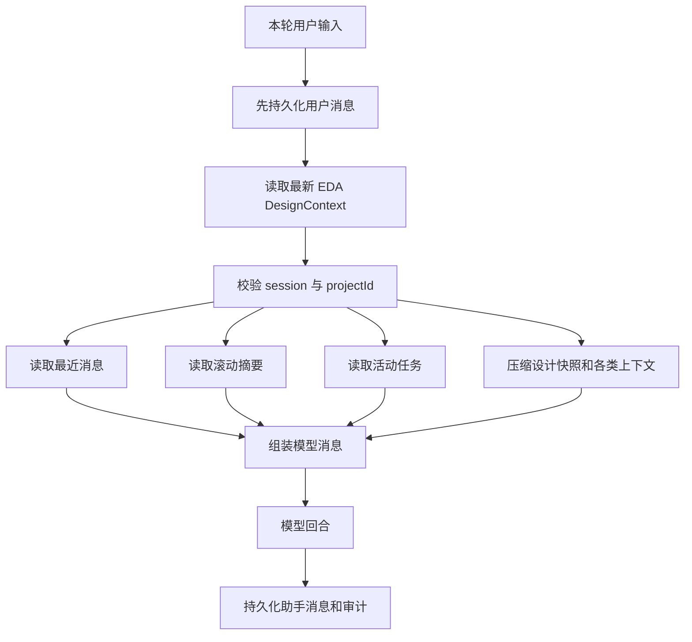
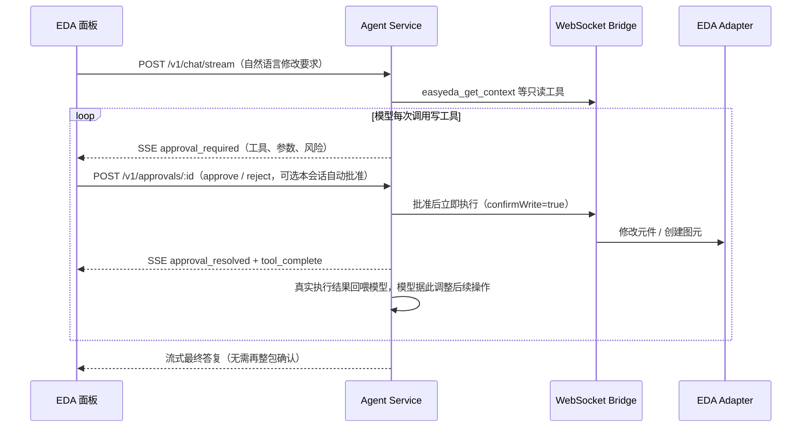
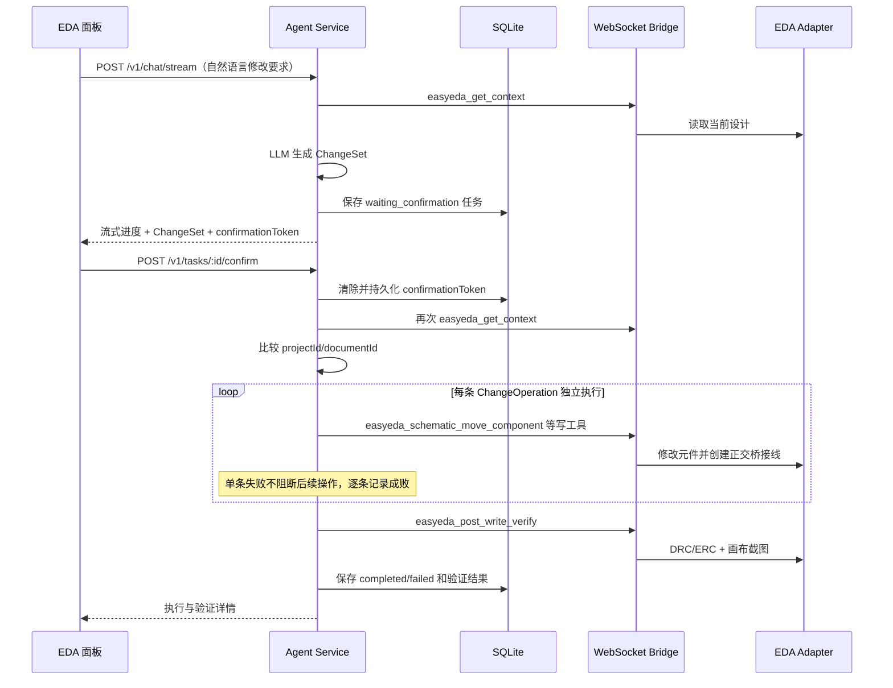
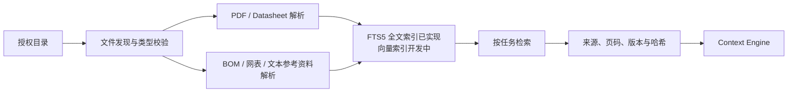
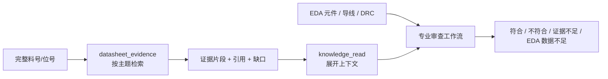

# JLCircuit Agent 完整架构与实现状态

> 文档状态：唯一维护的架构文档；同时描述当前实现和完整目标架构
> 最后复核：2026-09-01
> Agent Service：0.1.0
> 嘉立创 EDA 扩展：0.3.9

## 1. 文档目的

本文同时描述 JLCircuit Agent 的完整目标架构和当前仓库中已经运行的实现，包括：

- 完整分层架构、模块边界及开发状态；
- 嘉立创 EDA 扩展、Agent Service、LLM、MCP/插件和数据层的目标关系；
- 会话、上下文、工作记忆和任务状态的实际实现；
- Skill Registry、插件、外部目录、芯片手册和参考电路的接入方式；
- 统一对话、修改操作确认、执行和视觉验证流程；
- HTTP、WebSocket、工具目录、配置和持久化数据结构；
- 当前安全边界、已知限制和分阶段演进方向。

本文使用三种状态，任何未完成能力都不会按现成功能描述：

| 状态 | 含义 |
| --- | --- |
| **已实现** | 当前仓库已有可运行代码，并完成了至少本地自动化或接口验证 |
| **部分实现** | 主链路存在，但能力范围、兼容性或真实 EDA 验证仍不完整 |
| **开发中** | 属于目标架构，当前没有可依赖的完整运行链路 |

目前系统是一个以 Codex App Server 为默认智能体内核、带 Provider 子进程池、声明式 Skill Registry、MCP Gateway MVP、Local Knowledge MVP 和专业 Datasheet Review MVP 的本地 EDA Agent。外部目录授权、PDF/文本解析、中英文全文检索、按芯片/主题组织证据及与当前 EDA 数据交叉审查已经形成基础闭环；向量检索、OCR、结构化器件参数库、完整插件安装/隔离生命周期、跨 Provider 自动降级、项目语义长期记忆、通用回滚和多数 PCB 写入能力仍为**开发中**。

## 2. 架构原则与当前结论

架构采用“模型负责理解和规划，确定性工具负责读取、写入和验证”的分层方式。LLM 不直接访问嘉立创 EDA 原始 API，也不能执行任意 JavaScript。所有 EDA 操作必须经过工具权限、Agent Service 风险判断、本地 Bridge 和 EDA 扩展适配器。

已经形成的主闭环是：

```text
用户输入
  -> Context Engine 组装会话历史、任务和最新 EDA 快照
  -> Skill Registry 自动或显式选择工作流并裁剪可见工具
  -> 按需检索已授权的本地手册、BOM、网表并返回来源引用
  -> Datasheet Review 按芯片和主题生成证据包，与 EDA 元件/连线/DRC 对照
  -> Codex App Server 在选定 Provider 进程内执行持久化智能体回合
  -> 只读动态工具立即返回证据
  -> 写动态工具在流式回合内发起实时审批：用户批准后立即执行并把真实结果回喂模型
  -> 非流式路径、审批超时或流中断时，写操作退回结构化 ChangeSet 待确认计划
  -> 用户确认高风险操作（在线审批卡片或 ChangeSet 确认按钮）
  -> EDA 扩展执行受限工具
  -> DRC/ERC + 画布截图验证
  -> SQLite 保存消息、任务、快照和审计事件
```

当前闭环已经可运行，但只覆盖有限的 EDA 写工具，知识检索也还是全文索引 MVP。目标架构会在不破坏这条安全链的前提下增加向量/OCR、长期记忆、更多设计工具和通用事务执行器。

## 3. 完整架构图

### 3.1 完整目标架构及开发状态（合并前述补充架构图）

下面的图是系统应达到的完整架构，已合并最初分层方案以及后续补充的 Context/Memory、Skill、Plugin/MCP、外部知识、视觉验证、治理和评测层。图中已把尚未实现的组件直接标为“开发中”，而不是省略。



### 3.2 当前实际运行时拓扑

以下是当前代码真正运行的子集，不包含开发中的占位组件。



### 3.3 组件实现状态总表

| 层 | 当前状态 | 当前边界 | 下一完整能力 |
| --- | --- | --- | --- |
| EDA 多轮交互面板 | 已实现 | 统一流式对话、Provider/技能选择、修改确认、历史、MCP 配置与资料库管理 | Provider 配置编辑、差异预览、任务树、回滚入口 |
| Session / Context Engine | 已实现 | 项目隔离、消息、摘要、任务、最新快照 | 项目语义长期记忆与来源置信度 |
| Agent Orchestrator | 部分实现 | Codex App Server 持久化工具循环、JLCircuit 任务状态机、总时长/工具熔断、统一对话、ChangeSet、确认、单类写操作；旧 Supervisor 可回退 | 显式意图节点、持久化子任务图、跨回合自动恢复、事务与回滚 |
| Skill Registry | 已实现 | 声明式清单、提示、启停、自动选择、工具裁剪及专业手册审查工作流 | 依赖、签名、版本、安装和热更新 |
| Provider 进程池 | 已实现 | 每 Provider 一个按需 Codex App Server 进程、请求级选择、CLI 参数注入、状态/重启 API、会话 thread 恢复；只支持 Responses wire API | 空闲淘汰、配置热重载、健康熔断、自动降级和成本/延迟策略 |
| MCP / Plugin Gateway | 部分实现 | 官方客户端、stdio/HTTP、配置 CRUD、连接测试、能力查看、命名空间、allowlist、状态和审计 | OAuth、安装、自动重连、进程沙箱和外部写执行器 |
| 外部资料与知识库 | 部分实现 | 授权目录、PDF/文本/BOM/网表解析、FTS5 中英文检索、页码/行号/哈希引用、按芯片和主题构建证据包、管理界面 | OCR、向量/混合检索、网页采集、永久结构化器件参数库 |
| EDA 工具 | 部分实现 | 读取、DRC、截图、实验性元件移动 | 完整原理图、PCB、BOM、规则和脚本工具 |
| 执行与验证 | 部分实现 | 确认、项目校验、DRC、截图 | 通用前置条件、差异、事务、回滚和视觉评分 |
| 持久化与审计 | 已实现 | SQLite 会话、消息、任务、技能、知识索引、快照、审计 | 制品存储、防篡改审计、保留和迁移策略 |
| 鉴权与部署安全 | 部分实现 | MCP/资料库管理接口已有回环限制、Origin allowlist 和可选统一 Token；其他 API 仍主要依赖本机边界 | 用户身份、角色、严格 CORS、TLS/代理 |
| 评测与可观测性 | 开发中 | 单元测试和控制台日志 | Trace、固定电路集、视觉/电气正确性评测 |

### 3.4 进程边界

| 组件 | 所在进程 | 当前职责 |
| --- | --- | --- |
| 助手 iframe | 嘉立创 EDA | 用户输入、消息列表、专业手册审查入口、计划卡片、确认/取消、历史恢复、MCP 与资料库管理 |
| EDA 扩展入口 | 嘉立创 EDA | 打开 iframe、启动 Bridge Client |
| EDA Adapter | 嘉立创 EDA | 调用官方 Pro API，读取图元、执行移动、DRC 和截图 |
| Agent Service | 独立 Node.js 进程 | HTTP API、会话、任务、上下文、模型调用、知识索引、风险控制和审计 |
| Codex App Server Pool | Agent Service 子进程 | 每个 Provider 独立配置和连接池槽位；承载模型线程、工具循环和流式事件 |
| SQLite | Agent Service 本地文件 | 消息、任务、Codex thread 映射、技能状态、知识文档/分块/FTS、快照和审计持久化 |
| 已授权资料目录 | 本机文件系统 | 由管理员显式配置的只读 PDF、文本、BOM 和网表来源 |
| LLM Provider | 本地或远端服务 | 语言理解、规划、工具选择和视觉分析 |

嘉立创 EDA API 只能在扩展运行环境中调用。Agent Service 不假设自己能够直接读取 EDA 内部对象。

## 4. 仓库模块

```text
apps/agent-service/
  src/server.ts             HTTP、WebSocket、任务编排和执行入口
  src/context-engine.ts     上下文预算、历史、摘要、任务和设计快照组装
  src/storage.ts            SQLite schema 和持久化访问
  src/codex-provider-pool.ts Codex App Server JSON-RPC、Provider 进程池、动态工具与流式事件
  src/llm.ts                旧 OpenAI-compatible Chat Completions 后端（迁移回退）
  src/skill-registry.ts     技能扫描、校验、选择、启停与工具权限并集
  src/mcp-registry.ts       MCP 配置、连接生命周期、能力发现、命名空间和调用网关
  src/knowledge-service.ts  目录授权、文件发现、PDF/文本解析、分块、检索与引用

packages/contracts/         DesignContext、ChangeSet、ToolRequest 等共享契约
packages/bridge/            Bridge 消息和类型化传输封装
packages/mcp/               内置 EDA 静态工具目录（MCP 风格 schema）
config/
  codex-providers.example.json Provider 进程池安全配置示例
  mcp-servers.example.json  stdio 与 Streamable HTTP 安全配置示例
skills/builtin/             内置声明式技能（含 local-knowledge）

extensions/jlcircuit-eda/
  src/index.ts              扩展入口和助手窗口
  src/bridge-client.ts      EDA 侧 WebSocket 客户端
  src/eda-adapter.ts        嘉立创 EDA API 兼容与工具执行层
  iframe/index.html         多轮交互界面

docs/current-architecture.md 本文档
```

`packages/mcp` 仍只保存内置 EDA 的 `EdaToolDefinition[]` 静态目录。外部 MCP Client、`tools/resources/prompts` 发现和 Server 生命周期由 `apps/agent-service/src/mcp-registry.ts` 管理；本项目本身尚未作为 MCP Server 对外暴露 EDA 工具。

Skill Registry 只加载声明式清单和 Markdown 工作流，不执行技能目录中的脚本。它不等同于插件系统或 MCP Host。

## 5. 核心数据契约

### 5.1 DesignContext

`DesignContext` 是 EDA 当前状态的标准快照，主要包含：

- `project`：项目 ID 和名称；
- `activeDocument`：当前文档 ID、类型和名称；
- `selected`：当前选中对象；
- `summary`：原理图元件、导线和 API 诊断摘要；
- `drc`：DRC/ERC 结果；
- `capturedAt`：快照时间；
- `source`：数据来源。

当前原理图元件和导线读取是 best-effort 兼容层。不同 EDA 版本可能暴露不同字段或方法名，适配器会尝试多个候选字段。

### 5.2 写操作审批与 ChangeSet

写工具有两条确认路径，由 `JLCIRCUIT_WRITE_APPROVAL_MODE` 控制（默认 `inline`）：

- **在线审批（inline，默认）**：流式回合（`/v1/chat/stream`）中模型调用非只读工具时，回合暂停并通过 SSE 事件 `approval_required` 向面板推送审批卡片；用户批准后该操作立即以 `confirmWrite=true` 真实执行，执行结果（成功或失败详情）回喂给模型，模型可以逐条观察并自适应调整后续操作。拒绝时模型收到不可重试错误。用户可选择“批准并在本会话自动批准”，之后同会话写操作不再逐条询问。审批决定通过 `POST /v1/approvals/:approvalId` 提交，全程写入审计事件（`write_approval.requested/resolved/auto_approved`）。
- **ChangeSet 计划（兜底与兼容）**：非流式路径（`/v1/chat`、`/v1/plan`）、审批超时（默认 180s）或 SSE 断开时，写调用转换为 `ChangeOperation` 收集到 `ChangeSet`，回合结束后由用户整包确认执行。设 `JLCIRCUIT_WRITE_APPROVAL_MODE=changeset` 可恢复全量走此路径。

`ChangeSet` 结构：

```text
ChangeSet
  id
  projectId / documentId
  summary
  operations[]
    tool
    args
    targets
    riskLevel
    description
  requiresConfirmation
```

当前可进入真实执行链的原理图操作包括移动/放置元件，以及创建导线、总线、矩形、多边形和文本。每种操作在服务端有独立参数校验；放置元件必须具有可信的 `libraryUuid`、器件 `uuid` 和坐标，几何图元必须满足最小点数或正宽高约束。

### 5.3 Task

任务状态集合：

```text
planning
awaiting_user
waiting_confirmation
executing
completed
failed
cancelled
```

典型状态流：



当前每次重新规划会创建一个新任务，不会原地修改旧任务。失败后的“按原计划重试”同样创建新任务，但不调用模型：它只克隆失败任务中**未成功执行**的操作（依据 `execution.operations` 的逐条结果过滤，已成功的操作不再重复执行），记录 `parentTaskId` 并递增 `attempt`，然后重新进入待确认状态。若全部操作已成功、失败仅发生在写后验证阶段，则拒绝重试并提示重新运行 DRC/ERC。

## 6. 会话与 Context Engine

### 6.1 项目级会话隔离

助手面板首先通过探测会话读取当前 EDA 项目 ID，然后生成：

```text
jlcircuit-agent-ui:<projectId>
```

同一个项目再次打开助手时复用该会话。不同项目使用不同会话，避免设计历史互相污染。

Agent Service 在每个模型回合前再次校验会话绑定的 `projectId`。如果调用方把同一 `sessionId` 用于另一个项目，Context Engine 返回 `SESSION_PROJECT_MISMATCH` 并终止模型请求。

### 6.2 每轮上下文组装



上下文优先级为：

1. 系统安全策略；
2. 最新 EDA 快照；
3. 当前用户指令；
4. 最近对话；
5. 活动任务；
6. 较早会话摘要。

如果历史消息与最新 EDA 快照冲突，模型被明确要求以最新 EDA 快照为准。

### 6.3 上下文预算

| 配置 | 默认值 | 用途 |
| --- | ---: | --- |
| `JLCIRCUIT_CONTEXT_RECENT_MESSAGES` | 12 | 最近消息数量 |
| `JLCIRCUIT_CONTEXT_HISTORY_MAX_CHARS` | 12000 | 最近历史字符预算 |
| `JLCIRCUIT_CONTEXT_SUMMARY_MAX_CHARS` | 6000 | 较早消息摘要预算 |
| `JLCIRCUIT_CONTEXT_ACTIVE_TASKS` | 5 | 活动任务数量 |
| `JLCIRCUIT_CONTEXT_TASK_MAX_CHARS` | 6000 | 活动任务字符预算 |
| `JLCIRCUIT_LLM_CONTEXT_MAX_CHARS` | 40000 | EDA 设计上下文字符预算 |
| `JLCIRCUIT_LLM_CONTEXT_MAX_ITEMS` | 200 | 元件/导线样例数量上限 |

设计快照过大时，会保留项目、文档、选区、总数、截断标记以及有限数量的元件、导线和 DRC 项目。

### 6.4 当前记忆性质

当前已经实现的是会话工作记忆：

- 用户和助手消息；
- 较早消息的滚动摘要；
- 活动任务；
- 最新 EDA 快照；
- 工具和任务审计。

滚动摘要是确定性的摘录压缩，不是额外调用模型生成的语义摘要。当前没有自动提取“项目约束、器件决策、用户偏好”等长期事实，也不会把模型推测自动写成项目知识。

## 7. Skill Registry 与扩展边界

### 7.1 当前已实现

Skill Registry 在服务启动时扫描：

```text
skills/builtin/<skill-id>/skill.json
skills/builtin/<skill-id>/SKILL.md
```

也可通过 `JLCIRCUIT_SKILL_ROOTS` 增加管理员预先授权的技能根目录。当前技能是“声明 + Markdown 指令”，不会加载或执行技能目录中的 JavaScript、Python、Shell 或二进制文件。

`skill.json` 声明以下内容：

- `id`、名称、版本、描述和入口文件；
- 默认启用状态、优先级和最大风险级别；
- `always`、关键字和适用的运行模式；
- `tools.allowed` 和 `tools.required`。

加载时会检查技能 ID、重复项、入口越界、符号链接后的真实路径、说明文件大小、未知工具、必需工具和工具风险是否超过技能声明。启用/禁用覆盖状态写入 SQLite 的 `skill_states`。

当前内置技能：

| 技能 | 状态 | 用途 | 工具权限 |
| --- | --- | --- | --- |
| `eda-core` | 已实现 | 当前设计、元件、导线、DRC 和画布的只读分析 | 只读 EDA 工具 |
| `schematic-layout` | 已实现 | 布局可读性分析和元件移动计划 | 只读工具 + 高风险移动工具 |
| `mcp-assistant` | 已实现 | 调用管理员配置、启用和允许的 MCP 只读工具 | `mcp__*`，并受运行时风险过滤 |
| `local-knowledge` | 已实现 | 检索芯片手册、参考电路、引脚、BOM 和网表并强制保留来源 | `knowledge_sources/search/read` 只读工具 |
| `datasheet-review` | 已实现 | 按完整料号审查参数、引脚、去耦和典型应用，并与 EDA 元件/连线/DRC 对照 | `datasheet_evidence`、知识读取及 EDA 只读工具 |

### 7.2 每轮技能解析


技能权限只会缩小模型可见工具，不会扩大系统权限。即使技能允许高风险工具，模型回合也只会记录 `ChangeSet`；真实执行仍需要确认令牌和执行器 allowlist。外部 MCP 写工具当前不会进入执行链。

### 7.3 MCP Gateway 当前已实现

协议与传输实现基于 [MCP 官方 TypeScript Client SDK](https://ts.sdk.modelcontextprotocol.io/v2/get-started/first-client.html)；远程连接使用 Streamable HTTP，本地进程使用 `stdio`。

- 使用官方 `@modelcontextprotocol/client` 2.0.0；
- 本地 `stdio` 和远程 Streamable HTTP，支持协议版本协商；
- 通过 `.jlcircuit-data/mcp-servers.json` 注册 Server，并持久化启停覆盖状态；
- 发现 `tools`、`resources` 和 `prompts`，工具映射为 `mcp__<server>__<tool>`；
- Server 级工具 allowlist、默认风险和单工具风险覆盖；
- Skill Registry 通配权限与风险上限共同裁剪模型可见工具；
- 当前只执行 `riskLevel=read` 的外部工具，MCP 写工具不会提供给模型；
- Resources/Prompts 必须显式开放，并限制为连接后发现的条目；
- 请求超时、Server/工具/结果大小上限、HTTPS/回环 HTTP 约束；
- 连接、启停、失败和工具调用写入 SQLite 审计；
- 配置文件校验后通过临时文件原子替换，拒绝修改既有 Server ID；
- EDA 内的 MCP 管理窗口支持配置增删改、启停、连接、断开、独立连接测试和能力明细；
- 管理 API 只接受回环绑定和回环来源，可选统一 `JLCIRCUIT_ADMIN_TOKEN`；旧的 `JLCIRCUIT_MCP_ADMIN_TOKEN` 保留为兼容别名。Agent 自身的 `127.0.0.1`、`localhost` 和 `[::1]` Origin 默认允许，其他浏览器 Origin 必须显式加入 allowlist。

### 7.4 仍在开发中的插件能力

以下目标尚未实现：

- 技能包安装、卸载、依赖解析、签名、来源信任和版本锁定；
- 技能热更新、冲突解决、项目级启用范围和细粒度参数配置；
- OAuth 交互授权、旧 SSE fallback、失败自动重连和动态 capability 更新；
- 插件自动安装、签名验证、独立进程沙箱、CPU/内存限制和版本升级；
- 外部 MCP 写工具的差异预览、确认、通用执行和回滚。

声明式 Skill Registry 是 MCP/插件体系的上层工作流选择器，MCP Gateway 是工具、资源和提示的连接层，两者不会合并成同一个无边界执行入口。

### 7.5 Local Knowledge 当前已实现

`KnowledgeService` 提供独立于 MCP 的本地资料摄取与只读检索边界：

- 管理员在 EDA“资料库”窗口或受保护 API 中显式授权一个已经存在的绝对目录；
- 保存前解析真实路径，拒绝相对路径、重复根目录和非法 Source ID；扫描时跳过符号链接及 `.git`、`node_modules`、`dist`、`build` 等目录；
- 当前解析 PDF、纯文本、Markdown、JSON、CSV/TSV、YAML、HTML/XML、BOM、网表和日志；PDF 使用 `pdfjs-dist` 逐页提取文本；
- 按配置大小分块并保存文档/分块 SHA-256、PDF 页码或文本行号；
- SQLite FTS5 使用 `trigram` tokenizer 支持中英文关键词检索；
- `knowledge_sources`、`knowledge_search`、`knowledge_read` 和 `datasheet_evidence` 都是只读模型工具，其中读取只能使用已索引的 `documentId`/`chunkId`，不能传任意绝对路径；
- 返回模型的资料源和结果不包含根目录绝对路径，引用包含资料源、相对文件、页码或行号及哈希；
- 同一资料源的并发扫描会合并为一个 Promise；批量扫描按源串行执行，避免同时解析大量 PDF；
- 资料源增删改、扫描、检索和读取写入审计；删除资料源只删除 SQLite 索引，不修改原文件。

当前索引是本机 SQLite 全文检索，不是向量数据库。图片型/扫描版 PDF 无 OCR，HTML 解析是简化文本抽取，参考原理图仅能按已支持的文本/网表格式索引，尚未解析嘉立创专有二进制设计文件。

### 7.6 专业 Datasheet Review 当前已实现

`datasheet_evidence` 不直接输出模型推测的芯片参数。它先通过文件名、标题和全文命中锁定最多 16 份候选文档，再只在候选文档内把一个完整料号按专业主题拆成多个检索任务，避免手册后续页面没有重复印刷料号时漏检。当前主题包括器件概述、选型订购、电源、绝对最大额定值、推荐工作条件、引脚、时钟复位、接口、去耦、典型应用、布局以及封装热设计。每个主题返回：

- `found/missing` 覆盖状态；
- 命中的原始分块、匹配术语和检索分数；
- 相对文件、PDF 页码或文本行号、文档 SHA-256；
- 资料缺口以及不得用模型记忆补齐的提示。

`datasheet-review` 技能规定专业审查顺序：先确认完整料号，再构建证据包，必要时展开原文，然后读取 EDA 元件、导线和 DRC。最终结论只能是“符合、不符合、证据不足、当前 EDA 数据不足”，并强制区分绝对最大额定值与推荐工作条件。EDA 面板“手册审查”按钮会选择该技能并提供输入模板。

当前所谓“交叉检查”由模型基于受控证据包和 EDA 结构化工具结果完成，不会把派生结论写入永久参数库。若 EDA API 未返回完整引脚到网络映射，必须标为数据不足；DRC 通过也不能替代典型应用审查。

## 8. SQLite 持久化

默认数据库：

```text
.jlcircuit-data/jlcircuit-agent.sqlite
```

可通过 `JLCIRCUIT_DB_PATH` 修改。数据库启用外键、WAL 和 `synchronous=NORMAL`。服务收到 `SIGINT` 或 `SIGTERM` 时会关闭 Bridge、HTTP Server 和数据库。

### 8.1 表结构

| 表 | 主键 | 内容 | 保留策略 |
| --- | --- | --- | --- |
| `sessions` | `id` | 项目绑定、滚动摘要、摘要游标、当前任务指针 | 长期保留；清空对话时断开当前任务指针 |
| `messages` | `sequence` | 用户/助手消息、模式、模型、元数据 | 清空对话时删除 |
| `tasks` | `task_id` | 状态、上下文、技能、ChangeSet、确认令牌、执行结果 | 清空对话时保留 |
| `codex_threads` | `(session_id, provider_id)` | App Server thread ID、模型和动态工具签名 | 服务重启后恢复；清空对话或工具签名变化时删除/替换 |
| `context_snapshots` | `session_id` | 每个会话最新完整 EDA 快照及 SHA-256 | 新快照覆盖旧快照 |
| `audit_events` | `sequence` | 回合、工具、任务状态和错误事件 | 清空对话时保留 |
| `skill_states` | `skill_id` | 技能启用/禁用覆盖状态 | 长期保留 |
| `mcp_server_states` | `server_id` | MCP Server 启用/禁用覆盖状态 | 长期保留 |
| `knowledge_sources` | `id` | 已授权根目录、扩展名、启用状态和扫描时间 | 删除资料源时级联删除索引，不删除原文件 |
| `knowledge_documents` | `id` | 相对/绝对路径、类型、大小、mtime、SHA-256、页数和解析状态 | 重新扫描覆盖，源文件消失时删除 |
| `knowledge_chunks` | `id` | 文档分块、页码/行号、字符范围和分块哈希 | 随文档级联更新 |
| `knowledge_chunks_fts` | `rowid` | FTS5 trigram 全文索引 | 与知识分块同步维护 |

审计记录不会保存截图 Base64，只记录 `mimeType` 和字节数。较大的工具输入或结果会保存截断预览。审计表目前不是防篡改日志，也没有签名或远端备份。

## 9. 模型和工具循环

### 9.1 模型协议

默认后端由 Agent Service 为每个启用的 Provider 按需启动一个 `codex app-server`。进程间使用 stdin/stdout JSON-RPC：先执行 `initialize` 并启用 experimental API，再使用 `thread/start` 或 `thread/resume`，最后通过 `turn/start` 启动本轮。Provider 的 `base_url`、`model`、`wire_api=responses`、重试参数和密钥环境变量由子进程启动参数注入，不写入 Codex 全局 `config.toml`。每个 Provider 使用独立 `CODEX_HOME` 和空工作目录，避免加载用户全局 Skills/MCP；启动参数禁用 Plugin/App/Hook/Skill Search、Shell/Unified Exec、Browser/Computer Use、多智能体等内置能力，只保留 JLCircuit 动态工具。子进程环境只复制必要系统变量、本 Provider 密钥和显式 `envHttpHeaders` 引用。

JLCircuit 把本轮 Skill 过滤后的 EDA/MCP/知识工具作为 App Server `dynamicTools`。App Server 发起 `item/tool/call` 时：

- `riskLevel=read`：Agent Service 调用受限工具并返回 `inputText`，截图额外返回 `inputImage`；
- 非只读（流式回合且 `inline` 审批模式）：先通过 `approval_required` SSE 事件请求用户实时审批；批准后立即以 `confirmWrite=true` 执行并把真实结果返回模型，拒绝时返回不可重试错误；
- 非只读（无审批通道、审批超时或 `changeset` 模式）：创建 `ChangeOperation` 并返回 `planned=true`，不触达 EDA 写执行器，回合结束后走 ChangeSet 确认；
- 未注册、超出预算或执行失败：返回 `success=false` 并记录工具轨迹。

App Server 的 reasoning/正文 delta、工具状态、`thread/tokenUsage/updated` 和 turn 完成事件被转换为现有 `AgentRunEvent`，再由 `POST /v1/chat/stream` 通过 SSE 转发给 EDA 面板。也就是说，浏览器侧仍是 SSE，Agent Service 与智能体内核之间是 JSON-RPC 流。

每个 `(sessionId, providerId)` 持久化独立 thread。动态工具签名变化时创建新 thread，并把 SQLite 中的会话摘要和最近消息重新注入；进程重启而工具未变化时调用 `thread/resume`。同一 Provider 复用一个 App Server 进程，不同 Provider 之间进程、密钥和模型上下文隔离。

旧 `llm.ts` 的 Chat Completions + SSE Supervisor 仍可通过 `JLCIRCUIT_AGENT_BACKEND=legacy` 启用，用于尚不支持 Responses API 的兼容供应商。它不是默认路径。

### 9.2 智能体工具循环与停止条件

Codex App Server 自己驱动一次 turn 内的多次模型响应和动态工具调用，JLCircuit 不再用固定“最多三轮模型请求”判断完成。turn 在模型返回最终答复、请求用户补充、登记出待确认写操作、被中断或明确失败时结束。

JLCircuit 保留两类确定性熔断：`JLCIRCUIT_AGENT_MAX_TOOL_CALLS` 限制动态工具总数，`JLCIRCUIT_AGENT_MAX_ELAPSED_MS` 限制整轮时间。熔断只表示 `incomplete`/失败，不会伪装成已完成。模型最终通过隐藏状态标记区分 `completed`、`awaiting_user` 和 `blocked`；存在已登记写操作时，服务强制转为 `awaiting_approval`。

- 统一对话：只读工具正常执行；流式回合中非只读工具走在线审批（批准即执行、结果回喂模型），无审批通道时转换为待确认的 `ChangeOperation`。
- 自动技能选择：修改、移动、布局、整理等请求启用 `schematic-layout`，普通分析只使用所需只读技能。
- 在线审批优先、ChangeSet 兜底：批准的写操作在回合内执行，模型可根据真实结果调整后续操作；退回 ChangeSet 的操作在同一轮结果中显示“确认执行”按钮。
- 失败精确重试：失败任务只克隆未成功的操作为新任务，不调用模型；重新规划才建立父子任务关系并开启新 turn。
- 结果预算：单个工具结果默认限制为 50000 字符；超限返回截断信息和缩小查询范围提示。
- 工具权威性：App Server 当前收到的 `dynamicTools` 是本轮唯一可用工具来源；历史中的旧工具声明不授予权限。
- 没有写操作：允许正常说明、给出结论或追问；只有实际登记了操作才显示确认入口。
- “优先生成修改方案”：仍调用同一流式接口，只增强本轮指令并显式启用布局技能。

`legacy` 后端仍保留动作指纹、无进展检测、长度恢复和最终总结等旧 Supervisor 行为；这些能力不应被描述成 Codex App Server 默认路径的实现。

## 10. 修改执行和验证

在线审批（inline 模式默认路径）：



ChangeSet 兜底路径（非流式、审批超时或 changeset 模式）：



### 10.1 写入前保护

- 任务必须处于 `waiting_confirmation`；
- 确认令牌必须匹配；
- 确认令牌在执行前即从任务中清除并持久化，避免重复使用；
- 写入前重新读取当前项目和文档；
- 当前项目或文档与计划生成时不一致时终止执行；
- 执行器再次限制工具名，只允许当前已开放的写工具。

### 10.2 移动元件的实际语义

`easyeda_schematic_move_component`：

1. 读取元件旧坐标、旧引脚位置和完整导线快照；
2. 按旧引脚坐标查找其当前连接线和网络名；匹配使用 `lineContainsPoint`，即引脚落在导线折点或线段中间（T 形连接）都算连接，与写后验证逻辑一致；
3. 为每个已接线引脚预计算从旧位置到新位置的水平/垂直桥接路径；
4. 无法读取引脚、缺少导线创建/删除能力，或没有任何导线与引脚接触时，在移动前拒绝执行；只有确认元件原本未接线时才允许显式关闭 `preserveConnections`；
5. 调用 `SCH_PrimitiveComponent.modify` 修改坐标，保留全部原导线，再通过 `SCH_PrimitiveWire.create` 为每个已接线引脚创建独立正交桥接线；
6. 校验创建调用返回的图元，再通过按 ID 重读和短时重试等待画布读模型刷新；若返回图元有效但读模型仍不可见，则返回 `inconclusive` 并交给 DRC/ERC 和截图复核，不因缓存滞后自动回滚；
7. 创建失败时删除本轮已创建的桥接线并恢复元件旧坐标；
8. 成功时返回 `createdWireIds`、兼容字段 `movedWireIds`、`unresolvedWireIds` 和 `connectionCheck`。

这仍不是编辑器鼠标拖拽行为的完全等价实现。桥接线可能较长并穿过其他区域，复杂总线、网络标签和特殊连线仍可能无法自动保持，因此必须执行 DRC/ERC、截图和人工复核。

### 10.3 验证边界

执行后调用 `easyeda_post_write_verify`：

- 重新读取设计上下文；
- 执行 DRC/ERC；
- 获取当前画布或指定区域截图；
- 返回结构化结果和 PNG 图片内容。

截图用于视觉可读性检查，不替代网表、ERC/DRC 或人工复核。当前 EDA Adapter 只报告已经获得截图，未在扩展端自动计算文字碰撞、导线交叉或元件重叠。

## 11. EDA Bridge

Agent Service 监听：

```text
ws://127.0.0.1:49630/bridge
```

EDA 扩展主动连接，并使用官方 `eda.sys_WebSocket.register/send/close`。扩展需要 `allowExternalInteraction: true`。

### 11.1 握手

```json
{
  "type": "hello",
  "protocolVersion": 1,
  "client": "jlcircuit-eda-extension",
  "extensionVersion": "0.3.9",
  "capabilities": {}
}
```

Server 返回：

```json
{
  "type": "hello_ack",
  "protocolVersion": 1,
  "server": "jlcircuit-agent"
}
```

### 11.2 工具消息

```json
{
  "type": "request",
  "request": {
    "requestId": "uuid",
    "sessionId": "jlcircuit-agent-ui:project-id",
    "operation": "tool_call",
    "tool": "easyeda_get_context",
    "payload": {}
  }
}
```

Bridge 当前只保留一个活动 EDA 连接；新连接会替换旧连接。请求默认超时 15 秒。扩展上报的 capability 当前只用于握手日志，Agent 还没有根据 capability 动态裁剪静态工具目录。

## 12. 当前工具目录

| 工具 | 风险 | 状态 | 说明 |
| --- | --- | --- | --- |
| `easyeda_health_check` | read | 可用 | 扩展健康和 capability |
| `easyeda_get_context` | read | 可用 | 项目、文档、选区和摘要 |
| `easyeda_schematic_components` | read | Beta | 原理图元件和坐标 |
| `easyeda_schematic_wires` | read | Beta | 导线几何、网络和图元 ID |
| `easyeda_library_search_devices` | read | Beta | 按关键词或立创 C 编号查询器件库，返回放置所需 UUID |
| `easyeda_run_drc` | read | Beta | 当前文档 DRC/ERC |
| `easyeda_canvas_locate` | read | Beta | 画布定位和区域缩放 |
| `easyeda_canvas_capture` | read | Beta | 当前渲染区域 PNG |
| `easyeda_canvas_capture_region` | read | Beta | 指定区域 PNG |
| `easyeda_post_write_verify` | read | Beta | 上下文、DRC 和截图闭环 |
| `easyeda_schematic_move_component` | high | Beta | 移动元件并为已接线引脚创建正交桥接线 |
| `easyeda_schematic_place_component` | high | Beta | 按器件库 UUID 与器件 UUID 放置原理图元件 |
| `easyeda_schematic_create_wire` | high | Beta | 创建普通导线折线及可选网络名 |
| `easyeda_schematic_create_bus` | high | Beta | 创建命名总线折线 |
| `easyeda_schematic_create_rectangle` | high | Beta | 创建矩形模块边框 |
| `easyeda_schematic_create_polygon` | high | Beta | 创建不规则多边形边框 |
| `easyeda_schematic_create_text` | high | Beta | 创建原理图说明文本 |
| `knowledge_sources` | read | 可用 | 已授权资料源和索引统计，不返回绝对路径 |
| `knowledge_search` | read | 可用 | 中英文全文检索及页码/行号/哈希引用 |
| `knowledge_read` | read | 可用 | 仅按已索引文档或分块 ID 读取内容 |
| `datasheet_evidence` | read | 可用 | 按完整料号和专业主题组织手册证据及覆盖缺口 |

## 13. HTTP API

默认地址：`http://127.0.0.1:49630`

| 方法 | 路径 | 作用 |
| --- | --- | --- |
| GET | `/health` | 服务、Bridge 和 SQLite 状态 |
| GET | `/v1/tools` | 内置 EDA、Local Knowledge 与当前已连接 MCP 工具目录 |
| GET | `/v1/skills` | 技能目录、启用状态和加载诊断 |
| POST | `/v1/skills/reload` | 重新扫描技能根目录 |
| POST | `/v1/skills/:skillId/enable` | 启用技能并持久化状态 |
| POST | `/v1/skills/:skillId/disable` | 禁用技能并持久化状态 |
| GET | `/v1/mcp/servers` | MCP 配置路径、Server 状态和加载诊断 |
| GET | `/v1/mcp/config` | 管理视图所需的规范化配置和运行状态；需要本机管理权限 |
| POST | `/v1/mcp/reload` | 重新读取配置并按启用状态连接 |
| POST | `/v1/mcp/servers` | 新增、校验并原子保存 Server 配置 |
| POST | `/v1/mcp/servers/:serverId/update` | 更新配置；Server ID 不可变 |
| POST | `/v1/mcp/servers/:serverId/delete` | 删除配置、断开连接并清理启停覆盖状态 |
| POST | `/v1/mcp/servers/:serverId/enable` | 持久化启用并按策略连接 |
| POST | `/v1/mcp/servers/:serverId/disable` | 断开并持久化禁用 |
| POST | `/v1/mcp/servers/:serverId/connect` | 连接已启用 Server 并刷新能力 |
| POST | `/v1/mcp/servers/:serverId/disconnect` | 断开 Server |
| POST | `/v1/mcp/servers/:serverId/test` | 使用临时客户端验证握手和能力发现，不改变启停状态 |
| GET | `/v1/mcp/servers/:serverId/capabilities` | 查看已发现 Tools、Resources 和 Prompts |
| GET | `/v1/mcp/servers/:serverId/resources` | 列出已允许的已发现资源 |
| POST | `/v1/mcp/servers/:serverId/resources/read` | 读取已发现资源 |
| GET | `/v1/mcp/servers/:serverId/prompts` | 列出已允许的已发现提示 |
| POST | `/v1/mcp/servers/:serverId/prompts/get` | 获取已发现提示 |
| GET | `/v1/knowledge/sources` | 查看授权资料源、统计与根目录；需要本机管理权限 |
| POST | `/v1/knowledge/sources` | 新增并校验资料源；需要本机管理权限 |
| POST | `/v1/knowledge/reindex` | 顺序扫描全部启用资料源；需要本机管理权限 |
| POST | `/v1/knowledge/sources/:sourceId/update` | 更新资料源；根目录变化会清理旧索引；需要本机管理权限 |
| POST | `/v1/knowledge/sources/:sourceId/delete` | 删除资料源和索引，不删除原文件；需要本机管理权限 |
| POST | `/v1/knowledge/sources/:sourceId/scan` | 增量扫描单个资料源；需要本机管理权限 |
| GET | `/v1/knowledge/sources/:sourceId/documents` | 查看文档状态和解析错误；需要本机管理权限 |
| POST | `/v1/knowledge/search` | 全文搜索并返回来源引用；管理 UI 路由需要本机管理权限 |
| POST | `/v1/knowledge/read` | 按已索引文档或分块 ID 读取；管理 UI 路由需要本机管理权限 |
| POST | `/v1/sessions` | 创建随机会话 |
| GET | `/v1/sessions/:sessionId` | 恢复会话、最近 100 条消息和最近 20 个任务 |
| GET | `/v1/sessions/:sessionId/audit` | 返回最近 200 条审计事件 |
| POST | `/v1/sessions/:sessionId/clear` | 清除消息和摘要，保留任务与审计 |
| POST | `/v1/chat` | 统一非流式对话；可直接回答、追问或返回待确认 ChangeSet |
| POST | `/v1/chat/stream` | 统一 SSE 对话；实时阶段、推理、正文、工具状态、Token、可选 ChangeSet 和最终结果 |
| POST | `/v1/plan` | 旧客户端兼容接口；新 EDA 面板不再调用 |
| GET | `/v1/tasks/:taskId` | 查询任务 |
| POST | `/v1/approvals/:approvalId` | 提交流式回合内写操作的实时审批决定（approve/reject，可选会话级自动批准） |
| POST | `/v1/tasks/:taskId/retry` | 将失败任务中未成功的操作克隆为新的待确认 attempt，不调用模型 |
| POST | `/v1/tasks/:taskId/confirm` | 确认并执行写操作（逐条执行，单条失败不阻断其余操作） |
| POST | `/v1/tasks/:taskId/cancel` | 取消等待确认的任务 |
| POST | `/v1/context` | 读取并保存最新 EDA 快照 |
| POST | `/v1/drc` | 直接运行 DRC/ERC |
| POST | `/v1/tools/:toolName` | 直接调用内置 EDA、Local Knowledge 或只读 MCP 工具 |
| WS | `/bridge` | EDA 扩展 Bridge |

## 14. 配置

### 14.1 Agent 与持久化

| 配置 | 默认值 |
| --- | --- |
| `JLCIRCUIT_AGENT_HOST` | `127.0.0.1` |
| `JLCIRCUIT_AGENT_PORT` | `49630` |
| `JLCIRCUIT_DB_PATH` | `.jlcircuit-data/jlcircuit-agent.sqlite` |
| `JLCIRCUIT_BRIDGE_TIMEOUT_MS` | `15000` |
| `JLCIRCUIT_ADMIN_TOKEN` | 可选；统一保护 MCP 与资料库配置/生命周期 API |
| `JLCIRCUIT_ADMIN_ALLOWED_ORIGINS` | 可选；额外管理请求 Origin allowlist；Agent 自身回环 Origin 默认允许 |
| `JLCIRCUIT_WRITE_APPROVAL_MODE` | `inline`；流式回合内实时审批写操作；设为 `changeset` 恢复全量待确认计划流程 |
| `JLCIRCUIT_WRITE_APPROVAL_TIMEOUT_MS` | `180000`；单条写操作审批等待上限，超时退回 ChangeSet（等待时间计入 `JLCIRCUIT_AGENT_MAX_ELAPSED_MS` 总预算） |

### 14.2 Skill Registry

| 配置 | 默认值/作用 |
| --- | --- |
| `JLCIRCUIT_SKILL_ROOTS` | 额外受信技能根目录；使用系统路径分隔符 |
| `JLCIRCUIT_SKILL_AUTO_ACTIVATE` | `true`，允许关键字自动激活 |
| `JLCIRCUIT_SKILL_MAX_ACTIVE` | `3`，单轮最多启用技能数 |
| `JLCIRCUIT_SKILL_MAX_INSTRUCTION_CHARS` | `20000`，单技能说明字符上限 |

### 14.3 MCP Gateway

| 配置 | 默认值/作用 |
| --- | --- |
| `JLCIRCUIT_MCP_CONFIG` | `.jlcircuit-data/mcp-servers.json` |
| `JLCIRCUIT_MCP_AUTO_CONNECT` | `true`，自动连接已启用 Server |
| `JLCIRCUIT_MCP_REQUEST_TIMEOUT_MS` | `15000` |
| `JLCIRCUIT_MCP_MAX_SERVERS` | `16` |
| `JLCIRCUIT_MCP_MAX_TOOLS_PER_SERVER` | `100` |
| `JLCIRCUIT_MCP_MAX_TOOL_SCHEMA_CHARS` | `20000` |
| `JLCIRCUIT_MCP_MAX_RESULT_CHARS` | `1000000` |
| `JLCIRCUIT_MCP_ADMIN_TOKEN` | 兼容别名；未设置统一 Token 时使用 |
| `JLCIRCUIT_MCP_ADMIN_ALLOWED_ORIGINS` | 兼容/补充 Origin allowlist |

配置只保存环境变量名称，不保存密钥值。示例见 `config/mcp-servers.example.json`。管理窗口输入的管理令牌只保留在当前 EDA iframe 的 `sessionStorage`，不会写进 MCP 配置。

### 14.4 Local Knowledge

| 配置 | 默认值/作用 |
| --- | --- |
| `JLCIRCUIT_KNOWLEDGE_MAX_FILES` | `5000`，每个资料源单次最多发现文件数 |
| `JLCIRCUIT_KNOWLEDGE_MAX_FILE_BYTES` | `26214400`，单文件 25 MiB |
| `JLCIRCUIT_KNOWLEDGE_MAX_PDF_PAGES` | `1000` |
| `JLCIRCUIT_KNOWLEDGE_MAX_DEPTH` | `12`，目录递归深度 |
| `JLCIRCUIT_KNOWLEDGE_CHUNK_CHARS` | `4000`，分块字符数 |
| `JLCIRCUIT_KNOWLEDGE_CHUNK_OVERLAP` | `300`，相邻分块重叠字符数，最大不超过块长一半 |

### 14.5 Codex App Server Provider 进程池

| 配置 | 默认值/作用 |
| --- | --- |
| `JLCIRCUIT_AGENT_BACKEND` | `codex-app-server`；设为 `legacy` 启用旧后端 |
| `JLCIRCUIT_CODEX_COMMAND` | `codex`；可指定 Codex CLI 可执行文件 |
| `JLCIRCUIT_CODEX_PROVIDERS_CONFIG` | `.jlcircuit-data/codex-providers.json` |
| `JLCIRCUIT_CODEX_HOME_ROOT` | `.jlcircuit-data/codex-home`；每 Provider 独立 App Server 状态和空工作目录 |
| `JLCIRCUIT_CODEX_MAX_PROCESSES` | `4`；可同时驻留的 Provider 子进程数 |
| `JLCIRCUIT_CODEX_REQUEST_TIMEOUT_MS` | `30000`；App Server JSON-RPC 控制请求超时，不是整轮模型超时 |
| `JLCIRCUIT_LLM_TOOL_RESULT_MAX_CHARS` | 单个工具结果回传模型的字符预算，默认 50000；超限时截断并提示使用筛选参数 |
| `JLCIRCUIT_AGENT_MAX_TOOL_CALLS` | 单次运行工具调用总预算，默认 40 |
| `JLCIRCUIT_AGENT_MAX_ELAPSED_MS` | 单次运行时间预算，默认 300000ms |

Provider JSON 包含 `defaultProvider` 和 `providers`；每个 Provider 必须配置 `baseUrl`、`model`、`apiKeyEnv`、`wireApi: "responses"`，并可配置 `reasoningEffort`、请求/流重试、流空闲超时、HTTP Headers、Query Params 和 `modelMetadata`。第三方模型的 `modelMetadata` 以 `contextWindow`、`maxOutputTokens`、`inputModalities`、可选 `reasoningEfforts`/`defaultReasoningEffort` 描述模型能力；服务会为该 Provider 生成隔离的 `jlcircuit-model-catalog.json` 并以 `model_catalog_json` 传给其 App Server。目录文件无密钥、属于运行时产物，避免修改用户全局 Codex 配置，也避免未知模型回落到不准确的默认元数据。密钥由 Agent Service 的环境复制到对应子进程；静态 `httpHeaders` 中禁止 Authorization/API-Key 类敏感头，额外敏感头必须通过 `envHttpHeaders` 引用环境变量。示例见 `config/codex-providers.example.json`。

如果 Provider 配置文件不存在，服务会尝试从旧 `JLCIRCUIT_MODEL_PROVIDER`/`JLCIRCUIT_LLM_*` 环境合成一个进程内配置，便于迁移；正式部署应使用独立 JSON。配置在服务启动时加载，当前尚无热重载。

### 14.6 Legacy Chat Completions 与视觉路由

以下配置只完整适用于 `JLCIRCUIT_AGENT_BACKEND=legacy`；其中工具结果预算和 Agent 总预算由两个后端共用。

| 配置 | 作用 |
| --- | --- |
| `JLCIRCUIT_MODEL_PROVIDER` | 旧提供方标识或 `stub` |
| `JLCIRCUIT_LLM_BASE_URL` | Chat Completions-compatible Base URL |
| `JLCIRCUIT_LLM_API_KEY` | API Key |
| `JLCIRCUIT_LLM_MODEL` | 语言模型名 |
| `JLCIRCUIT_LLM_TIMEOUT_MS` | 请求流空闲超时 |
| `JLCIRCUIT_LLM_MAX_TOKENS` | 单次请求最大输出 token，默认 `4096` |
| `JLCIRCUIT_LLM_STREAMING` | 是否使用模型 SSE，默认 true |
| `JLCIRCUIT_LLM_TOOL_STREAM` | 是否发送流式 Function Call 扩展参数 |
| `JLCIRCUIT_LLM_REASONING_EFFORT` | 普通请求 reasoning 强度 |
| `JLCIRCUIT_LLM_FINAL_REASONING_EFFORT` | 最终总结和长度恢复 reasoning 强度 |
| `JLCIRCUIT_LLM_MAX_LENGTH_RECOVERIES` | `finish_reason=length` 后自动总结次数，默认 1 |
| `JLCIRCUIT_AGENT_MAX_NO_PROGRESS` | 旧 Supervisor 连续无进展阈值，默认 2 |
| `JLCIRCUIT_AGENT_MAX_RETRIES_PER_ACTION` | 旧 Supervisor 相同动作重试上限，默认 2 |
| `JLCIRCUIT_AGENT_FINALIZE_TIMEOUT_MS` | 旧 Supervisor 最终总结超时，默认 60000ms |

| 视觉配置 | 作用 |
| --- | --- |
| `JLCIRCUIT_LLM_SUPPORTS_VISION` | 当前语言模型是否直接支持图片 |
| `JLCIRCUIT_VISION_LLM_BASE_URL` | 独立视觉模型地址 |
| `JLCIRCUIT_VISION_LLM_API_KEY` | 独立视觉模型密钥；省略时复用语言模型密钥 |
| `JLCIRCUIT_VISION_LLM_MODEL` | 独立视觉模型名 |
| `JLCIRCUIT_VISION_LLM_TIMEOUT_MS` | 视觉请求超时 |

Codex App Server 路径把截图作为动态工具 `inputImage` 返回当前 Provider；因此当前要求所选 Provider 模型本身支持图像。跨 Provider 独立视觉降级尚未接入进程池。

## 15. 安全边界

### 15.1 已实现

- 服务默认只监听 `127.0.0.1`；
- 模型不直接访问 EDA API；
- 模型回合中的非只读工具必须经过用户批准才执行：流式回合内逐条实时审批（可会话级自动批准），无审批通道时记录为待确认 ChangeSet；
- 在线审批的请求、决定和自动批准均写入审计事件；ChangeSet 路径的写操作需要确认令牌；
- 写入前重新校验项目和文档；
- 项目级会话隔离；
- EDA 工具有风险等级和静态 allowlist；
- 模型工具列表还会被本轮启用技能的 `tools.allowed` 并集裁剪；
- 技能入口限制在技能自身目录，拒绝未知工具、重复 ID 和超限说明；
- MCP Server 必须显式配置和启用，工具还要经过 Server allowlist、风险和 Skill 权限；
- 外部工具默认 `high`，当前只向模型提供并执行显式标为 `read` 的 MCP 工具；
- 远程 MCP 必须使用 HTTPS，只有回环地址允许 HTTP；
- MCP 密钥通过环境变量引用，调用受超时和结果预算限制；
- MCP 与资料库管理 API 共用回环地址、Origin allowlist 和可选统一管理 Token；
- 本地资料源必须显式授权绝对目录，扫描跳过符号链接，并在读取前校验真实路径仍位于授权根目录；
- 模型不能传文件路径读取本机文件，只能检索或读取已索引 ID，且返回模型的数据不含根目录绝对路径；
- 专业手册工具只返回证据包和缺口，不把无来源的模型推测固化为芯片参数；
- 截图 Base64 不写入审计数据库；
- `.env`、数据库和密钥文件默认被 Git 忽略。

### 15.2 当前缺口

- `JLCIRCUIT_BRIDGE_TOKEN` 虽然出现在配置示例中，但当前 HTTP 和 WebSocket 握手没有实际校验该 Token；
- 普通 HTTP API 的 CORS 当前仍为 `*`，安全性依赖服务只绑定本机地址；MCP 与资料库管理接口另有回环来源、Origin allowlist 和可选管理令牌保护；
- HTTP API 没有用户身份、角色或授权范围；
- capability 上报没有用于服务端动态禁用不可用工具；
- 确认令牌会持久化并通过任务 API 返回，当前安全前提是 Agent 只在可信本机运行；
- SQLite 中包含项目上下文和对话，不应放到公共同步目录；
- Provider JSON 不保存密钥；Provider 子进程只继承必要系统环境、本 Provider 密钥和显式 Header 环境变量，并使用独立 `CODEX_HOME`，但仍只能使用受信的 `codex` 可执行文件和配置；
- 审计日志可被本机用户修改，不是合规级防篡改日志；
- 直接 `/v1/tools/:toolName` 调用仍依赖工具自身的 `confirmWrite` 校验，不应暴露到非本机网络。
- 尚无 MCP OAuth 交互授权、自动重连、签名安装和强进程沙箱；stdio Server 是本机子进程，必须只配置可信命令。

如果把 `JLCIRCUIT_AGENT_HOST` 改为非回环地址，必须先实现鉴权、严格 CORS、TLS 或受控反向代理，并补 Bridge Token 校验。

## 16. 当前已知限制

1. 原理图已支持器件库搜索、移动/放置元件和创建导线、总线、矩形、多边形、文本；删除、替换、属性修改、网络标签、端口和电源符号尚未开放。
2. 元件移动不是鼠标拖拽的完全等价实现。
3. 通用 `applyChangeSet` 明确未启用。
4. PCB 写入、自动布线、铺铜和规则修改尚未开放。
5. Context Engine 只有会话工作记忆，没有项目语义长期记忆。
6. 较早会话摘要是摘录压缩，不是语义摘要。
7. 已能动态连接配置文件中的 MCP Server，但不支持插件自动安装、签名和版本升级。
8. Skill Registry 目前只支持声明式提示与静态工具权限，不执行代码，也不支持依赖解析和热安装。
9. 本地资料库目前只有 FTS5 全文检索，没有向量/混合检索、OCR、网页采集或嘉立创专有设计格式解析。
10. Datasheet Review 尚未建立永久结构化参数库、表格级解析器或文档版本优先级；交叉检查质量仍受 EDA 引脚/网络可见性限制。
11. Codex Provider 进程池目前只支持 Responses wire API；Chat Completions-only 供应商必须使用旧后端。
12. App Server 动态工具接口仍属于 experimental API；当前已用 Codex CLI 0.151.0 生成的协议类型复核，并由本地协议夹具回归，升级 CLI 时必须重跑兼容测试。
13. Provider 配置只在 Agent Service 启动时加载，尚无热重载、空闲进程淘汰或自动故障转移。
14. Codex 后端的截图交给当前 Provider 模型，尚未接入独立视觉 Provider 降级。
15. Codex thread 使用 `read-only` sandbox、空工作目录和禁止 shell/文件读取的开发指令；当前仍没有独立 OS 账户或容器级强隔离，部署方必须把 Provider 子进程视为受信本机代码。
16. 任务执行没有通用事务或自动回滚点；ChangeSet 批量执行为逐条独立执行，单条失败不阻断也不回滚其他操作（部分成功会在任务消息中给出成功/失败统计，重试仅重放失败项）。元件移动工具已单独实现写前快照、失败回滚和端点复核，新增 create 类工具目前只有单项参数/读回校验。
17. Bridge 只支持单个活动 EDA 连接。
18. MCP 外部写工具不会提供给模型，也没有确认执行链。
19. Node.js 内置 SQLite 在当前 Node 24 运行时可能打印 `ExperimentalWarning`。

## 17. 完整目标架构的开发路线

阶段状态以当前仓库为准；“完成”只表示该阶段定义的基础闭环完成，不代表相关 EDA API 已覆盖全部场景。

| 阶段 | 状态 | 主要交付 |
| --- | --- | --- |
| 阶段 0：EDA Bridge 与可视验证 | 部分实现 | WebSocket Bridge、上下文读取、DRC、截图、实验性元件移动；复杂连线和更多 EDA API 仍需验证 |
| 阶段 1：多轮交互与安全计划 | 已实现 | 统一流式对话、允许正常回答或追问、ChangeSet、确认/取消、任务卡片 |
| 阶段 2：上下文、会话与持久化 | 已实现 | 项目级会话、消息历史、滚动摘要、活动任务、EDA 快照、SQLite 和审计 |
| 阶段 2.1：Codex 智能体内核与 Provider 池 | 部分实现 | App Server 子进程池、请求级 Provider 选择、动态工具、流式事件、token、thread 持久化和旧后端回退已完成；热重载、自动路由/降级和独立视觉降级仍在开发 |
| 阶段 3：声明式 Skill Registry | 已实现 | 扫描、校验、自动/显式选择、提示注入、工具权限裁剪、状态持久化和 EDA 面板选择器；仍需扩大真实 EDA 多技能回归范围 |
| 阶段 4：Plugin/MCP Gateway | 部分实现 | 官方 MCP Client、stdio/Streamable HTTP、配置管理界面、CRUD、连接测试、能力查看、发现、命名空间、allowlist、风险、超时和审计；OAuth、自动重连、安装沙箱及外部写执行仍在开发 |
| 阶段 5：Local Knowledge | 部分实现 | 已完成授权目录、PDF/文本/BOM/网表解析、FTS5 检索、来源引用、管理界面和只读模型工具；向量检索、OCR、网页/专有设计格式解析仍在开发 |
| 阶段 6：专业 Datasheet Skills | 部分实现 | 已完成按完整料号/主题构建证据包、覆盖缺口、专业提示约束、手册审查入口及 EDA 元件/连线/DRC 交叉检查流程；表格结构化、版本优先级和参考网表自动比对仍在开发 |
| 阶段 7：项目长期记忆 | 开发中 | 带来源、置信度和生效范围的约束、决策、器件和问题记录 |
| 阶段 8：通用执行与回滚 | 开发中 | 旧值前置条件、差异预览、事务、回滚点、更多原理图/PCB/BOM/规则工具 |
| 阶段 9：安全、观测与评测 | 开发中 | Token/鉴权、严格 CORS、Trace、指标、固定电路集、视觉和电气正确性评测 |

### 17.1 阶段 4：Plugin/MCP Gateway 边界（MVP 已实现，增强能力开发中）

MCP Gateway 不直接获得无限制 EDA 写权限。外部 MCP Server 必须经过注册清单、传输类型、工具命名空间、风险级别、参数 schema、超时和允许访问的资源范围校验。模型只能看到本轮技能和策略共同允许的 MCP 工具。

目标调用链：

```text
Skill / Orchestrator
  -> MCP Gateway
  -> Plugin Registry + Permission Policy
  -> 内置或外部 MCP Server
  -> tools / resources / prompts
  -> 标准化结果与审计
```

### 17.2 阶段 4.1：MCP 配置与管理界面（已实现）

EDA 助手通过受保护的本地管理 API 完成 MCP Server 配置 CRUD、启停、连接、断开、独立测试和能力查看。写配置前使用与运行时相同的 schema 和安全规则校验，再通过临时文件原子替换；界面只接受密钥环境变量名，不接受密钥值。该阶段没有放宽模型工具权限，外部 MCP 工具仍只有显式标为 `read` 的工具可以执行。

### 17.3 阶段 5：外部目录与资料知识库（MVP 已实现，增强能力开发中）

外部资料必须先由用户或管理员授权目录，随后按文件类型经过解析、分块、索引和来源记录。读取芯片手册或参考电路时，模型应返回文件、页码/章节或原始设计来源，不能把检索结果当成无来源事实。



当前已落地的是：资料源 CRUD、启停与增量扫描，PDF.js 逐页文本提取，文本行号定位，SQLite v4 文档/分块/FTS5 表，四项只读知识/手册工具，`local-knowledge` 自动技能，以及 EDA 内资料库配置、文档错误查看和测试搜索界面。尚未实现 OCR、embedding、rerank、网页同步和专有原理图结构解析。

### 17.4 阶段 6：专业 Datasheet Skills（MVP 已实现，增强能力开发中）



基础闭环不预先猜测手册表格结构，而是把供电、推荐条件、极限值、引脚、时钟复位、接口、去耦、典型应用、布局和封装热设计分别检索。模型必须对具体数值、引脚功能和建议保留来源。多芯片选型比较时，对每个完整料号使用相同主题分别构建证据包。

后续增强包括：PDF 表格和章节结构化解析、芯片/封装/温度后缀归一化、文档版本优先级、参考网表自动比对、器件参数缓存与失效规则，以及固定芯片集上的事实准确率评测。

### 17.5 阶段 7：项目长期记忆（开发中）

长期记忆与普通聊天摘要分开保存，目标记录包括：

- 明确的设计约束，例如电压、接口、尺寸、层数和成本；
- 用户确认的器件选择及替代关系；
- 已批准或否决的架构决策；
- 已知问题、验证证据和未完成事项；
- 来源消息、资料文件、设计版本、置信度和失效条件。

模型推测不能自动升级为长期事实。写入长期记忆需要明确来源，并允许用户查看、修订和删除。

### 17.6 阶段 8：通用执行器（开发中）

目标执行器在每个操作中保存 `expectedBefore`、目标对象、可逆参数和验证规则。执行前比较旧值；执行中建立回滚点；执行后同时进行结构化、DRC/ERC 和视觉验证。任何一步失败都应停止剩余操作，并优先恢复到已知状态。

## 18. 验证和构建

```powershell
npm install
npm run check
npm test
npm run dev
```

扩展构建：

```powershell
npm run build:extension
```

输出：

```text
extensions/jlcircuit-eda/build/dist/jlcircuit-agent_v0.3.9.eext
```

测试覆盖当前包括：

- SQLite 关闭并重新打开后的会话、消息、任务、技能状态和审计恢复；
- SQLite v1 到 v6 的技能、MCP 状态、知识索引和 Codex thread 映射迁移；
- 较早消息滚动摘要；
- Context Engine 合并历史、活动任务和最新 EDA 快照；
- 跨项目会话污染阻止；
- 目标驱动 Agent 可跨越三次工具请求继续运行，并在工具/时间预算或无进展熔断后执行无工具阶段总结；
- 模型可区分普通完成、等待用户输入和工具阻塞，内部状态标记不会显示给用户；
- Codex Provider 配置校验、App Server JSON-RPC 初始化、动态只读/写工具、流式 reasoning/content/usage、进程复用和 thread 持久化恢复；
- Skill Registry 的 always、关键字和显式选择；
- 内置 Datasheet Review 技能自动激活、专业证据工具与 EDA 只读权限联合裁剪；
- 技能工具权限并集、启停持久化和非法清单诊断；
- MCP stdio 与 Streamable HTTP 真实握手、能力发现和工具调用；
- MCP allowlist、默认风险、启停持久化、Resources/Prompts 和不安全 HTTP 拒绝；
- MCP 配置新增、更新、删除、原子持久化、独立连接测试和状态清理；
- Local Knowledge 绝对目录授权、相对路径拒绝、文本/BOM/PDF 解析、中英文检索、页码/行号引用、绝对路径隐藏、增量扫描和删除文件清理；
- Datasheet evidence 按芯片和主题检索、主题覆盖/缺口、禁用资料源阻断以及引用完整性。

真实 EDA API 行为、移动元件后的复杂连线、电气正确性和视觉可读性仍必须在嘉立创 EDA 中进行人工或设备环境验证。
