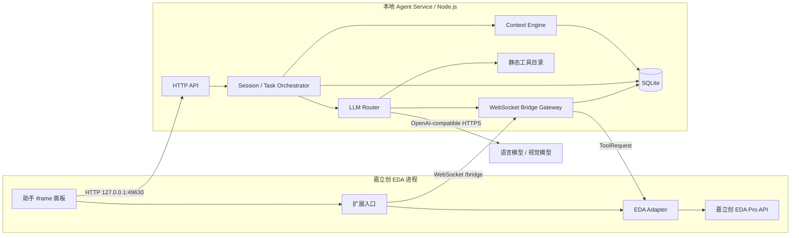
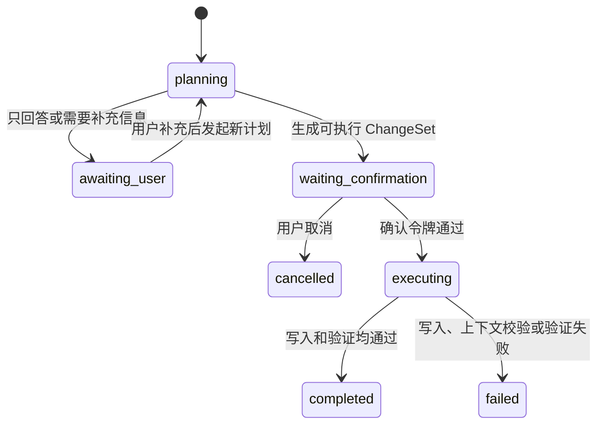
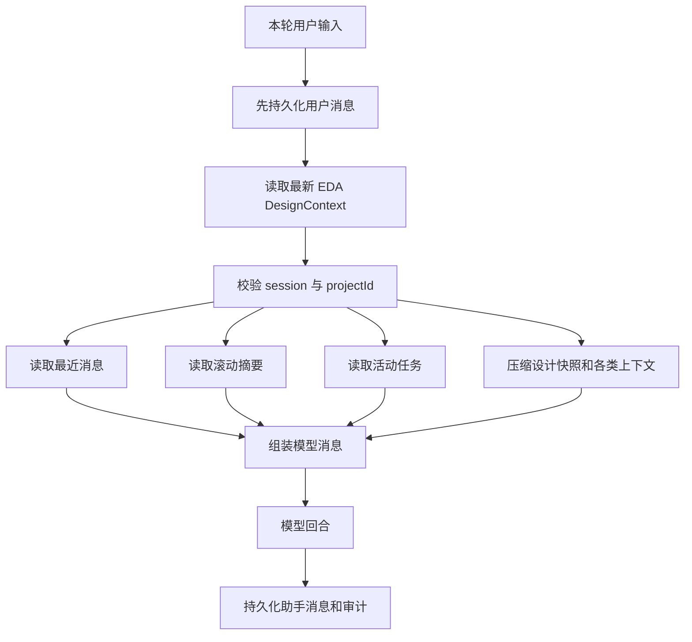
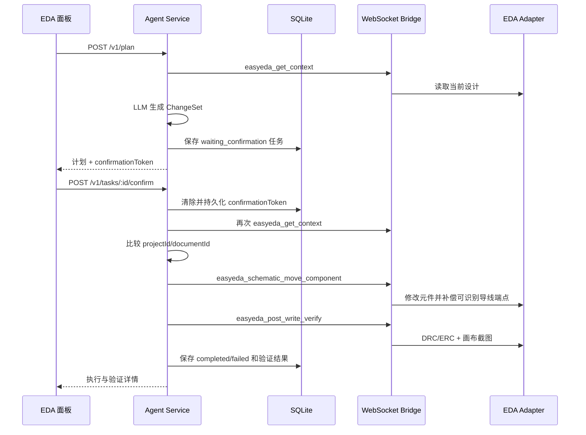

# JLCircuit Agent 当前架构

> 文档状态：与当前仓库实现对齐
> 最后复核：2026-08-25
> Agent Service：0.1.0
> 嘉立创 EDA 扩展：0.2.0

## 1. 文档目的

本文描述当前已经运行在仓库中的 JLCircuit Agent 架构，包括：

- 嘉立创 EDA 扩展、Agent Service、LLM 和 SQLite 的进程边界；
- 会话、上下文、工作记忆和任务状态的实际实现；
- 只读分析、修改计划、用户确认、执行和视觉验证流程；
- HTTP、WebSocket、工具目录、配置和持久化数据结构；
- 当前安全边界、已知限制和下一阶段扩展方向。

本文严格区分“已实现”和“规划中”。目前系统是一个可验证的本地 EDA Agent MVP，还不是完整的动态 MCP Host，也还没有 Skill Registry、插件管理器、外部文档知识库或项目级语义长期记忆。

## 2. 架构结论

当前架构采用“模型负责理解和规划，确定性工具负责读取、写入和验证”的分层方式。LLM 不直接访问嘉立创 EDA 原始 API，也不能执行任意 JavaScript。所有 EDA 操作必须经过静态工具目录、Agent Service 风险判断、本地 WebSocket Bridge 和 EDA 扩展适配器。

已经形成的主闭环是：

```text
用户输入
  -> Context Engine 组装会话历史、任务和最新 EDA 快照
  -> LLM 分析或生成结构化 ChangeSet
  -> 用户确认高风险操作
  -> EDA 扩展执行受限工具
  -> DRC/ERC + 画布截图验证
  -> SQLite 保存消息、任务、快照和审计事件
```

## 3. 当前运行时拓扑



### 3.1 进程边界

| 组件 | 所在进程 | 当前职责 |
| --- | --- | --- |
| 助手 iframe | 嘉立创 EDA | 用户输入、消息列表、计划卡片、确认/取消、历史恢复 |
| EDA 扩展入口 | 嘉立创 EDA | 打开 iframe、启动 Bridge Client |
| EDA Adapter | 嘉立创 EDA | 调用官方 Pro API，读取图元、执行移动、DRC 和截图 |
| Agent Service | 独立 Node.js 进程 | HTTP API、会话、任务、上下文、模型调用、风险控制和审计 |
| SQLite | Agent Service 本地文件 | 消息、任务、快照和审计持久化 |
| LLM Provider | 本地或远端服务 | 语言理解、规划、工具选择和视觉分析 |

嘉立创 EDA API 只能在扩展运行环境中调用。Agent Service 不假设自己能够直接读取 EDA 内部对象。

## 4. 仓库模块

```text
apps/agent-service/
  src/server.ts             HTTP、WebSocket、任务编排和执行入口
  src/context-engine.ts     上下文预算、历史、摘要、任务和设计快照组装
  src/storage.ts            SQLite schema 和持久化访问
  src/llm.ts                OpenAI-compatible 模型调用和工具循环

packages/contracts/         DesignContext、ChangeSet、ToolRequest 等共享契约
packages/bridge/            Bridge 消息和类型化传输封装
packages/mcp/               当前静态 MCP 风格工具目录

extensions/jlcircuit-eda/
  src/index.ts              扩展入口和助手窗口
  src/bridge-client.ts      EDA 侧 WebSocket 客户端
  src/eda-adapter.ts        嘉立创 EDA API 兼容与工具执行层
  iframe/index.html         多轮交互界面

docs/current-architecture.md 本文档
```

`packages/mcp` 当前只保存 `EdaToolDefinition[]` 静态目录。它不是完整的 MCP JSON-RPC Server，也没有动态 `tools/list`、`resources/list`、`prompts/list` 或外部 MCP Server 生命周期管理。

## 5. 核心数据契约

### 5.1 DesignContext

`DesignContext` 是 EDA 当前状态的标准快照，主要包含：

- `project`：项目 ID 和名称；
- `activeDocument`：当前文档 ID、类型和名称；
- `selected`：当前选中对象；
- `summary`：原理图元件、导线和 API 诊断摘要；
- `drc`：DRC/ERC 结果；
- `capturedAt`：快照时间；
- `source`：数据来源。

当前原理图元件和导线读取是 best-effort 兼容层。不同 EDA 版本可能暴露不同字段或方法名，适配器会尝试多个候选字段。

### 5.2 ChangeSet

模型在计划模式下调用高风险工具时，不会立即执行，而是转换为 `ChangeOperation` 并收集到 `ChangeSet`：

```text
ChangeSet
  id
  projectId / documentId
  summary
  operations[]
    tool
    args
    targets
    riskLevel
    description
  requiresConfirmation
```

当前可进入真实执行链的操作只允许 `easyeda_schematic_move_component`，并且必须具有合法的 `primitiveId`、`x` 和 `y`。

### 5.3 Task

任务状态集合：

```text
planning
awaiting_user
waiting_confirmation
executing
completed
failed
cancelled
```

典型状态流：



当前每次重新规划会创建一个新任务，不会原地修改旧任务。

## 6. 会话与 Context Engine

### 6.1 项目级会话隔离

助手面板首先通过探测会话读取当前 EDA 项目 ID，然后生成：

```text
jlcircuit-agent-ui:<projectId>
```

同一个项目再次打开助手时复用该会话。不同项目使用不同会话，避免设计历史互相污染。

Agent Service 在每个模型回合前再次校验会话绑定的 `projectId`。如果调用方把同一 `sessionId` 用于另一个项目，Context Engine 返回 `SESSION_PROJECT_MISMATCH` 并终止模型请求。

### 6.2 每轮上下文组装



上下文优先级为：

1. 系统安全策略；
2. 最新 EDA 快照；
3. 当前用户指令；
4. 最近对话；
5. 活动任务；
6. 较早会话摘要。

如果历史消息与最新 EDA 快照冲突，模型被明确要求以最新 EDA 快照为准。

### 6.3 上下文预算

| 配置 | 默认值 | 用途 |
| --- | ---: | --- |
| `JLCIRCUIT_CONTEXT_RECENT_MESSAGES` | 12 | 最近消息数量 |
| `JLCIRCUIT_CONTEXT_HISTORY_MAX_CHARS` | 12000 | 最近历史字符预算 |
| `JLCIRCUIT_CONTEXT_SUMMARY_MAX_CHARS` | 6000 | 较早消息摘要预算 |
| `JLCIRCUIT_CONTEXT_ACTIVE_TASKS` | 5 | 活动任务数量 |
| `JLCIRCUIT_CONTEXT_TASK_MAX_CHARS` | 6000 | 活动任务字符预算 |
| `JLCIRCUIT_LLM_CONTEXT_MAX_CHARS` | 40000 | EDA 设计上下文字符预算 |
| `JLCIRCUIT_LLM_CONTEXT_MAX_ITEMS` | 200 | 元件/导线样例数量上限 |

设计快照过大时，会保留项目、文档、选区、总数、截断标记以及有限数量的元件、导线和 DRC 项目。

### 6.4 当前记忆性质

当前已经实现的是会话工作记忆：

- 用户和助手消息；
- 较早消息的滚动摘要；
- 活动任务；
- 最新 EDA 快照；
- 工具和任务审计。

滚动摘要是确定性的摘录压缩，不是额外调用模型生成的语义摘要。当前没有自动提取“项目约束、器件决策、用户偏好”等长期事实，也不会把模型推测自动写成项目知识。

## 7. SQLite 持久化

默认数据库：

```text
.jlcircuit-data/jlcircuit-agent.sqlite
```

可通过 `JLCIRCUIT_DB_PATH` 修改。数据库启用外键、WAL 和 `synchronous=NORMAL`。服务收到 `SIGINT` 或 `SIGTERM` 时会关闭 Bridge、HTTP Server 和数据库。

### 7.1 表结构

| 表 | 主键 | 内容 | 保留策略 |
| --- | --- | --- | --- |
| `sessions` | `id` | 项目绑定、滚动摘要、摘要游标 | 长期保留 |
| `messages` | `sequence` | 用户/助手消息、模式、模型、元数据 | 清空对话时删除 |
| `tasks` | `task_id` | 状态、上下文、ChangeSet、确认令牌、执行结果 | 清空对话时保留 |
| `context_snapshots` | `session_id` | 每个会话最新完整 EDA 快照及 SHA-256 | 新快照覆盖旧快照 |
| `audit_events` | `sequence` | 回合、工具、任务状态和错误事件 | 清空对话时保留 |

审计记录不会保存截图 Base64，只记录 `mimeType` 和字节数。较大的工具输入或结果会保存截断预览。审计表目前不是防篡改日志，也没有签名或远端备份。

## 8. 模型和工具循环

### 8.1 模型协议

Agent Service 使用 OpenAI-compatible `POST /chat/completions`，发送：

- `model`；
- `messages`；
- `tools`；
- `tool_choice: auto`；
- `temperature: 0.2`；
- `max_tokens`。

支持当前语言模型直接看图，或单独配置视觉模型。Base URL 可以是 `/v1` 根地址，也可以带 `/chat/completions`，服务会进行规范化。

### 8.2 工具回合

模型最多执行 `JLCIRCUIT_LLM_MAX_TOOL_ROUNDS` 轮工具调用，默认 3 轮。

- Chat 模式：只执行 `riskLevel=read` 工具；写工具被阻止。
- Plan 模式：只读工具正常执行；高风险工具转换为待确认的 `ChangeOperation`。
- 没有写操作：允许模型直接回答或追问，任务进入 `awaiting_user`。
- “强制生成执行计划”：使用更明确的内部指令再次请求，但仍不允许模型猜测缺失参数。

## 9. 修改执行和验证



### 9.1 写入前保护

- 任务必须处于 `waiting_confirmation`；
- 确认令牌必须匹配；
- 确认令牌在执行前即从任务中清除并持久化，避免重复使用；
- 写入前重新读取当前项目和文档；
- 当前项目或文档与计划生成时不一致时终止执行；
- 执行器再次限制工具名，只允许当前已开放的写工具。

### 9.2 移动元件的实际语义

`easyeda_schematic_move_component`：

1. 读取元件旧引脚位置；
2. 读取导线快照；
3. 调用 `SCH_PrimitiveComponent.modify` 修改坐标；
4. 重新读取引脚位置；
5. 对能匹配旧引脚端点的导线首尾点执行补偿；
6. 返回 `movedWireIds`、`unresolvedWireIds` 和 `connectionCheck`。

这不是编辑器鼠标拖拽行为的完全等价实现。复杂分支、总线、网络标签和特殊连线仍可能无法自动保持。

### 9.3 验证边界

执行后调用 `easyeda_post_write_verify`：

- 重新读取设计上下文；
- 执行 DRC/ERC；
- 获取当前画布或指定区域截图；
- 返回结构化结果和 PNG 图片内容。

截图用于视觉可读性检查，不替代网表、ERC/DRC 或人工复核。当前 EDA Adapter 只报告已经获得截图，未在扩展端自动计算文字碰撞、导线交叉或元件重叠。

## 10. EDA Bridge

Agent Service 监听：

```text
ws://127.0.0.1:49630/bridge
```

EDA 扩展主动连接，并使用官方 `eda.sys_WebSocket.register/send/close`。扩展需要 `allowExternalInteraction: true`。

### 10.1 握手

```json
{
  "type": "hello",
  "protocolVersion": 1,
  "client": "jlcircuit-eda-extension",
  "extensionVersion": "0.2.0",
  "capabilities": {}
}
```

Server 返回：

```json
{
  "type": "hello_ack",
  "protocolVersion": 1,
  "server": "jlcircuit-agent"
}
```

### 10.2 工具消息

```json
{
  "type": "request",
  "request": {
    "requestId": "uuid",
    "sessionId": "jlcircuit-agent-ui:project-id",
    "operation": "tool_call",
    "tool": "easyeda_get_context",
    "payload": {}
  }
}
```

Bridge 当前只保留一个活动 EDA 连接；新连接会替换旧连接。请求默认超时 15 秒。扩展上报的 capability 当前只用于握手日志，Agent 还没有根据 capability 动态裁剪静态工具目录。

## 11. 当前工具目录

| 工具 | 风险 | 状态 | 说明 |
| --- | --- | --- | --- |
| `easyeda_health_check` | read | 可用 | 扩展健康和 capability |
| `easyeda_get_context` | read | 可用 | 项目、文档、选区和摘要 |
| `easyeda_schematic_components` | read | Beta | 原理图元件和坐标 |
| `easyeda_schematic_wires` | read | Beta | 导线几何、网络和图元 ID |
| `easyeda_run_drc` | read | Beta | 当前文档 DRC/ERC |
| `easyeda_canvas_locate` | read | Beta | 画布定位和区域缩放 |
| `easyeda_canvas_capture` | read | Beta | 当前渲染区域 PNG |
| `easyeda_canvas_capture_region` | read | Beta | 指定区域 PNG |
| `easyeda_post_write_verify` | read | Beta | 上下文、DRC 和截图闭环 |
| `easyeda_schematic_move_component` | high | Beta | 移动元件并补偿可识别导线端点 |

## 12. HTTP API

默认地址：`http://127.0.0.1:49630`

| 方法 | 路径 | 作用 |
| --- | --- | --- |
| GET | `/health` | 服务、Bridge 和 SQLite 状态 |
| GET | `/v1/tools` | 静态工具目录和 Bridge 状态 |
| POST | `/v1/sessions` | 创建随机会话 |
| GET | `/v1/sessions/:sessionId` | 恢复会话、最近 100 条消息和最近 20 个任务 |
| GET | `/v1/sessions/:sessionId/audit` | 返回最近 200 条审计事件 |
| POST | `/v1/sessions/:sessionId/clear` | 清除消息和摘要，保留任务与审计 |
| POST | `/v1/chat` | 连续对话和只读工具分析 |
| POST | `/v1/plan` | 生成 ChangeSet 或请求补充信息 |
| GET | `/v1/tasks/:taskId` | 查询任务 |
| POST | `/v1/tasks/:taskId/confirm` | 确认并执行写操作 |
| POST | `/v1/tasks/:taskId/cancel` | 取消等待确认的任务 |
| POST | `/v1/context` | 读取并保存最新 EDA 快照 |
| POST | `/v1/drc` | 直接运行 DRC/ERC |
| POST | `/v1/tools/:toolName` | 直接调用静态工具 |
| WS | `/bridge` | EDA 扩展 Bridge |

## 13. 配置

### 13.1 Agent 与持久化

| 配置 | 默认值 |
| --- | --- |
| `JLCIRCUIT_AGENT_HOST` | `127.0.0.1` |
| `JLCIRCUIT_AGENT_PORT` | `49630` |
| `JLCIRCUIT_DB_PATH` | `.jlcircuit-data/jlcircuit-agent.sqlite` |
| `JLCIRCUIT_BRIDGE_TIMEOUT_MS` | `15000` |

### 13.2 语言模型

| 配置 | 作用 |
| --- | --- |
| `JLCIRCUIT_MODEL_PROVIDER` | 提供方标识或 `stub` |
| `JLCIRCUIT_LLM_BASE_URL` | OpenAI-compatible Base URL |
| `JLCIRCUIT_LLM_API_KEY` | API Key |
| `JLCIRCUIT_LLM_MODEL` | 语言模型名 |
| `JLCIRCUIT_LLM_TIMEOUT_MS` | 请求超时 |
| `JLCIRCUIT_LLM_MAX_TOKENS` | 最大输出 token |
| `JLCIRCUIT_LLM_MAX_TOOL_ROUNDS` | 最大工具轮数 |

### 13.3 视觉模型

| 配置 | 作用 |
| --- | --- |
| `JLCIRCUIT_LLM_SUPPORTS_VISION` | 当前语言模型是否直接支持图片 |
| `JLCIRCUIT_VISION_LLM_BASE_URL` | 独立视觉模型地址 |
| `JLCIRCUIT_VISION_LLM_API_KEY` | 独立视觉模型密钥；省略时复用语言模型密钥 |
| `JLCIRCUIT_VISION_LLM_MODEL` | 独立视觉模型名 |
| `JLCIRCUIT_VISION_LLM_TIMEOUT_MS` | 视觉请求超时 |

## 14. 安全边界

### 14.1 已实现

- 服务默认只监听 `127.0.0.1`；
- 模型不直接访问 EDA API；
- Chat 模式阻止写工具；
- Plan 模式只记录写操作，不立即执行；
- 写操作需要确认令牌；
- 写入前重新校验项目和文档；
- 项目级会话隔离；
- EDA 工具有风险等级和静态 allowlist；
- 截图 Base64 不写入审计数据库；
- `.env`、数据库和密钥文件默认被 Git 忽略。

### 14.2 当前缺口

- `JLCIRCUIT_BRIDGE_TOKEN` 虽然出现在配置示例中，但当前 HTTP 和 WebSocket 握手没有实际校验该 Token；
- HTTP CORS 当前为 `*`，安全性依赖服务只绑定本机地址；
- HTTP API 没有用户身份、角色或授权范围；
- capability 上报没有用于服务端动态禁用不可用工具；
- 确认令牌会持久化并通过任务 API 返回，当前安全前提是 Agent 只在可信本机运行；
- SQLite 中包含项目上下文和对话，不应放到公共同步目录；
- 审计日志可被本机用户修改，不是合规级防篡改日志；
- 直接 `/v1/tools/:toolName` 调用仍依赖工具自身的 `confirmWrite` 校验，不应暴露到非本机网络。

如果把 `JLCIRCUIT_AGENT_HOST` 改为非回环地址，必须先实现鉴权、严格 CORS、TLS 或受控反向代理，并补 Bridge Token 校验。

## 15. 当前已知限制

1. 真实写入只支持原理图元件移动。
2. 元件移动不是鼠标拖拽的完全等价实现。
3. 通用 `applyChangeSet` 明确未启用。
4. PCB 写入、自动布线、铺铜和规则修改尚未开放。
5. Context Engine 只有会话工作记忆，没有项目语义长期记忆。
6. 较早会话摘要是摘录压缩，不是语义摘要。
7. 当前工具目录为静态代码，不支持动态安装插件。
8. 尚无 Skill Registry。
9. 尚无外部目录、芯片手册、参考电路和 RAG 知识库。
10. 任务执行没有通用事务或自动回滚点。
11. Bridge 只支持单个活动 EDA 连接。
12. Node.js 内置 SQLite 在当前 Node 24 运行时可能打印 `ExperimentalWarning`。

## 16. 后续演进方向

推荐按以下顺序继续：

1. **安全加固**：Bridge Token、HTTP 鉴权、严格 Origin、请求体限制和速率限制。
2. **Skill Registry**：加载声明式工作流、提示模板、所需工具和风险权限。
3. **Plugin/MCP Gateway**：从静态目录升级为内置工具加外部 MCP Server。
4. **Local Knowledge Plugin**：授权目录、PDF 页面提取、全文检索和来源引用。
5. **Datasheet / Reference Design Skills**：手册关键章节、引脚表、典型应用和参考网表分析。
6. **项目长期记忆**：明确来源和置信度的约束、决策、器件和问题记录。
7. **更完整的执行器**：更多 EDA 工具、预期旧值、事务、回滚点和差异预览。
8. **评测体系**：固定原理图样本、工具调用回归、截图可读性和电气正确性评测。

## 17. 验证和构建

```powershell
npm install
npm run check
npm test
npm run dev
```

扩展构建：

```powershell
npm run build:extension
```

输出：

```text
extensions/jlcircuit-eda/build/dist/jlcircuit-agent_v0.2.0.eext
```

测试覆盖当前包括：

- SQLite 关闭并重新打开后的会话、消息、任务和审计恢复；
- 较早消息滚动摘要；
- Context Engine 合并历史、活动任务和最新 EDA 快照；
- 跨项目会话污染阻止。

真实 EDA API 行为、移动元件后的复杂连线、电气正确性和视觉可读性仍必须在嘉立创 EDA 中进行人工或设备环境验证。
